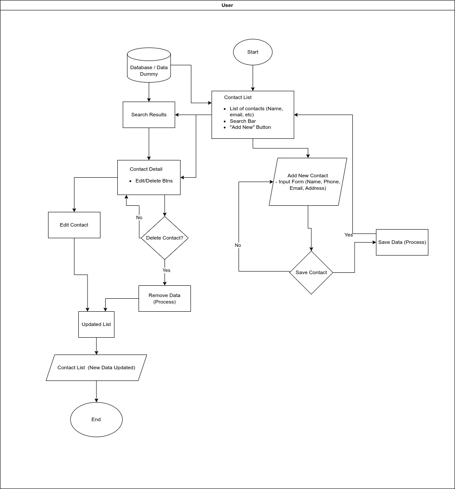

# Address Book

**Address Book** is a user-friendly application designed to streamline the way you manage your personal and professional connections. This intuitive tool provides all the essential features you need to keep your contacts organized and easily accessible.   

**Features**:
- **Contact List**: Display a list of contacts with their names and essential details.
- **Contact Details**: Clicking on a contact should open a page displaying detailed information, including phone numbers, email addresses, and any additional notes.
- **Add New Contact**: Provide a form or interface to add new contacts with fields for name, phone number, email, address, and notes.
- **Delete and Edit Contact**: Allow users to delete and edit existing contact information.
- **Search Functionality**: Implement a search bar to quickly find contacts by name or other relevant details.

## Flowchart

### Flowchart Image

### Business Flow:

#### 1. Start
- **User Action**: User accesses the system.
- **Access Page**: Landing page ("Contact List").

#### 2. Contact List
- **Description:**
  - Displays a list of contacts with names, emails, and essential details.
  - Includes a "Search Bar" and ""Add New" Button".
- **Key Features:**
  - **Search Functionaly:** Filter contacts by name, email, etc.
  - **Add New Contact:** Redirects to input form.

#### 3. Add New Contact
Process:

1.  User clicks "Add New" Button.

2.  Input form opens with fields:
    - Name
    - Email
    - Phone
    - Address
    - Notes

3. Submit triggers "Save Data (Process)".

#### 4. Save Data (Process)
- **System Action:**
    - Validates input fields (e.g., email format).
    - Stores data in Database / Data Dummy.
    - Redirects to "Contact List (New Data Updated)".

#### 5. Search Results
- **Process**:
  - User types query in the Search Bar.
  - System filters and displays results in "Contact List" format.
  - Clicking a contact opens **Contact Detail**.

#### 6. Contact Detail
- Description:
  - Displays full contact information.
  - Includes **Edit/Delete Bins** (buttons).
- User Actions:
  - Edit: Redirects to Edit Contact form.
  - Delete: Triggers Delete Contact? confirmation.

#### 7. Edit Contact
- Process:
  1. Pre-filled form with existing data.
  2. User updates fields.
  3. Save triggers Save Data (Process) → Updates Contact List.

#### 8. Delete Contact? (Decision Point)
- Confirmation Dialog:
  - **Yes**: Proceeds to **Remove Data (Process).**
  - **No**: Returns to **Contact Detail** or **Contact List**.

#### 9. Remove Data (Process)
- **System Action**:
  - Deletes contact from Database / Data Dummy.
  - Redirects to Contact List (New Data Updated).

#### 10. Contact List (New Data Updated)
- **Description**:
  - Reflects changes after additions, edits, or deletions.
  - Automatically refreshes post-action.

#### 11. End
- **Exit Point**: User logs out or closes the system.